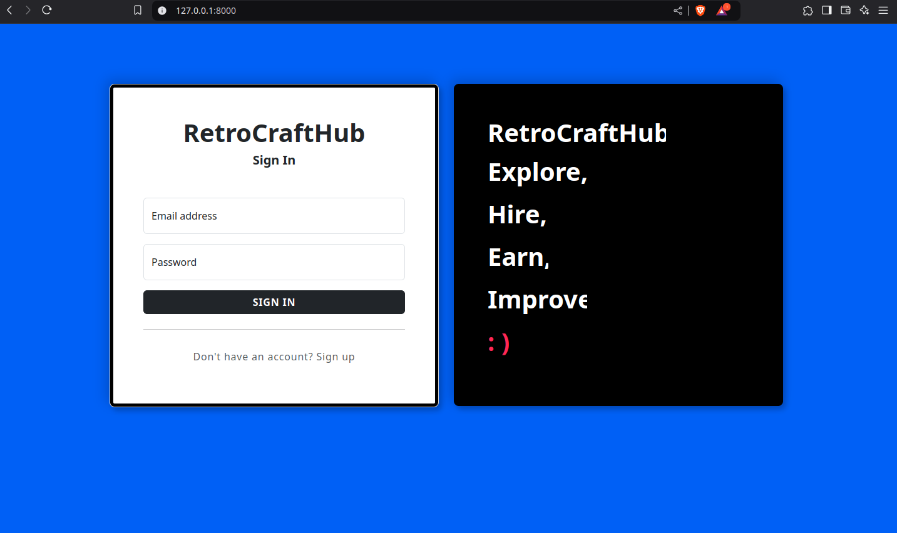
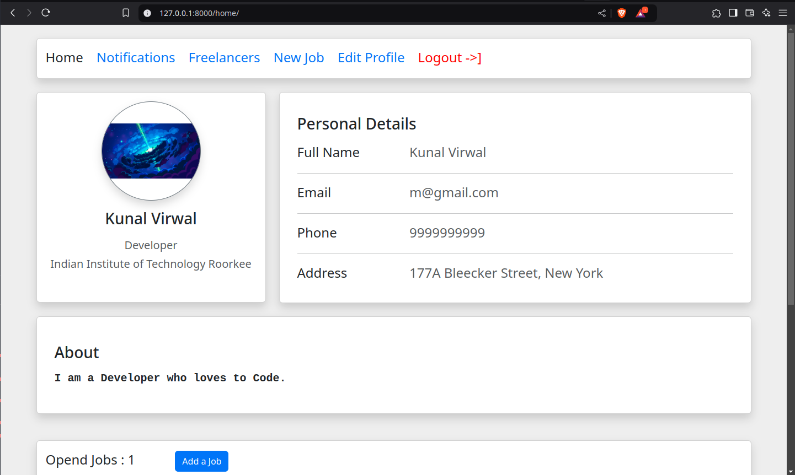
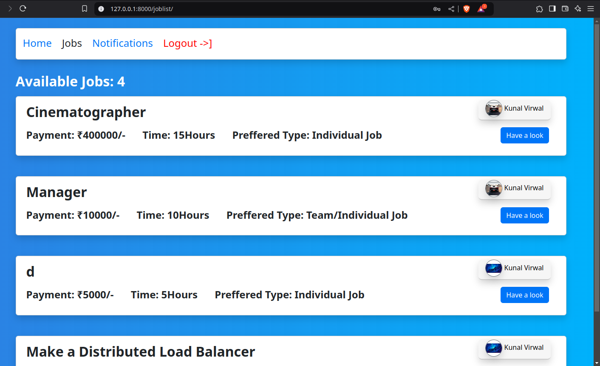

# RetroCraft-Hub
***
This repository holds a Django based web application which is a Freelancing website i.e. RetroCraftHub.
Here recruiters can offer jobs and find young and experienced freelancers,
Whereas freelancers can lookout for job opportunities and explore trusted recruiters.

RetroCraftHub was my first Web App I have made it on my own as a solo project.
In the process I learned how to make Django based websites and APIs.
This project is already deployed at https://kunal-retrocrafthub.onrender.com (can take a couple of minutes to load).

## How to run on localhost:
1) Clone the repository and cd to the Freelancing-Website repository (master repo).
   
2) Copy the contents of `sample.env` to `.env` and add `SECRET_KEY` in .env
   
3) Create a virtual environment inside master repository and run it using
```
python -m venv env
.\env\Scripts\activate
```   
4) Install all the modules in requirements.txt using
```
pip install -r requirements. txt
```
5) Finally
`python manage.py runserver`
   And visit (http://127.0.0.1:8000/)

Here's how it would look like...

  
    
  

and many more...
<p align=center>
Made with ❤️ by Kunal
</p>
